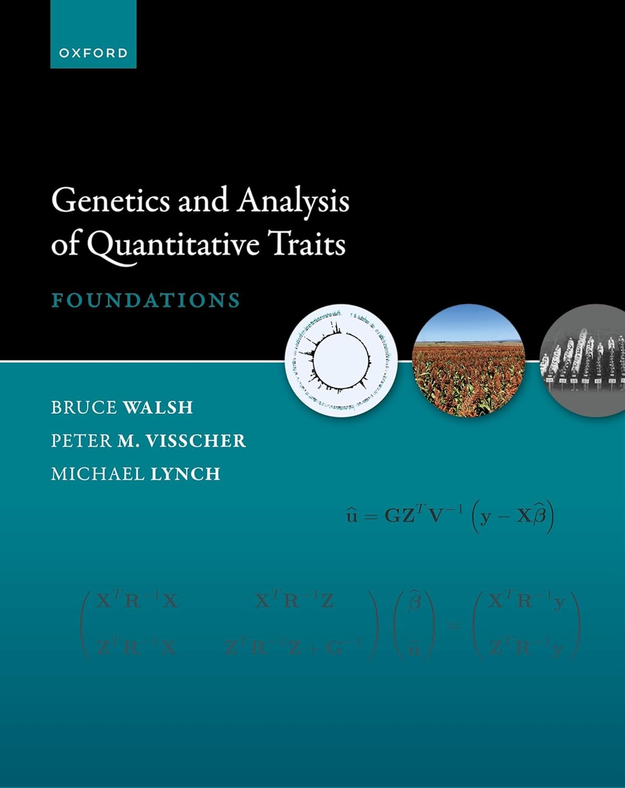
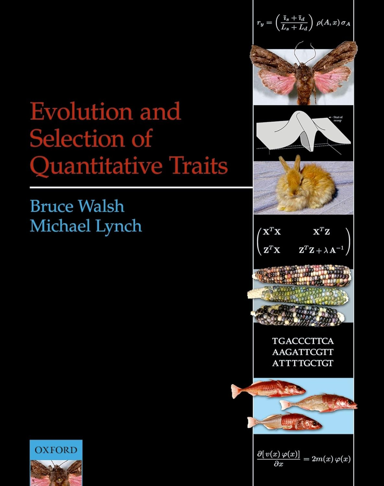
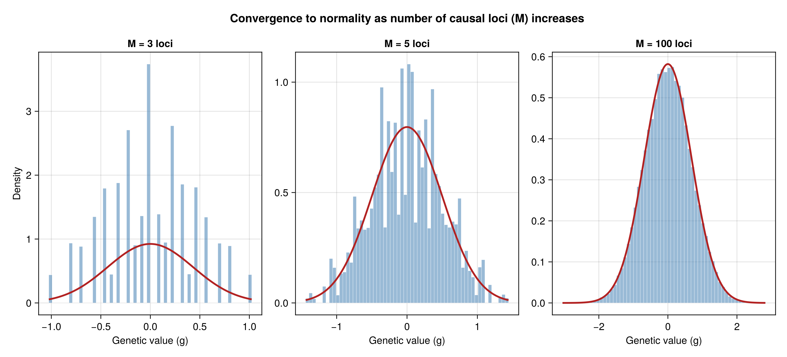

## Lecture Outline

1. **Part 0: Statistical tools**

   Variance, covariance, correlation, and the central limit theorem
2. **Part 1: Quantitative genetics and the infinitesimal model**

   Why many small Mendelian effects produce continuous variation and resemblance among relatives
3. **Part 2: Estimating genetic variance**

   Parent-offspring regression, twin designs, and mixed models (GREML)
4. **Part 3: Practical**

   Simulation and worked examples in R and Julia

# Part 0: Statistical Tools {background-color="#2c3e50" style="color: white;"}

## Random variables and expectation

A **random variable** $X$ is a quantity whose value is uncertain. We don't know its exact value, but we know the probability of the values it can take - it has a distribution.

The **expectation** (mean) summarizes its center — the "balance point" of the distribution:

:::: {.columns}
::: {.column width="60%"}

```{r}
#| echo: false
#| fig-width: 6
#| fig-height: 3.2
#| fig-align: center
x <- seq(-4, 4, length.out = 400)
y <- dnorm(x)
mu <- 0

par(mar = c(2.5, 0.5, 0.5, 0.5))
plot(x, y, type = "n", axes = FALSE, xlab = "", ylab = "",
     xlim = c(-4, 4), ylim = c(-0.06, 0.44))
polygon(c(x, rev(x)), c(y, rep(0, length(y))),
        col = adjustcolor("#3498db", 0.35), border = NA)
lines(x, y, col = "#2c3e50", lwd = 2.5)
segments(mu, 0, mu, dnorm(mu), col = "#e74c3c", lwd = 2.5, lty = 2)
# fulcrum triangle
tri_h <- 0.045; tri_w <- 0.35
polygon(c(mu - tri_w, mu + tri_w, mu),
        c(-tri_h, -tri_h, 0),
        col = "#e74c3c", border = "#c0392b", lwd = 2)
text(mu, -tri_h - 0.015, expression(E(X) == mu), cex = 1.3, col = "#c0392b",
     pos = 1, font = 2)
axis(1, at = -4:4, labels = -4:4, col = "#555555", col.axis = "#555555",
     lwd = 1.5, cex.axis = 0.9)
```

:::
::: {.column width="40%"}

A linear transformation of a random variable $aX + b$ has expectation:

$$E[aX + b] = a\,E[X] + b$$

:::
::::


## Variance

The **variance** measures the spread of a random variable around its mean:

$$\text{Var}(X) = E\!\left[(X - \mu_X)^2\right]$$

For a linear transformation $aX + b$, the constant has no effect and the variance scales by $a^2$:

$$\text{Var}(aX + b) = a^2 \, \text{Var}(X)$$

::: {.callout-note}
- Scaling is linear for expectation ($a$) but quadratic for variance ($a^2$).
- Adding a constant ($b$) changes expectation but not variance.
:::

## Covariance and correlation

The **covariance** measures how two variables move together:

$$\text{Cov}(X, Y) = E\!\left[(X - \mu_X)(Y - \mu_Y)\right]$$

The **correlation** is the standardized version:

$$r_{XY} = \frac{\text{Cov}(X, Y)}{\sigma_X \, \sigma_Y} \in [-1, 1]$$

::: {.callout-note}
## Two useful rules
- Linear scaling: $\text{Cov}(aX + c,\, bY + d) = ab\,\text{Cov}(X,\, Y)$
- Covariance with itself is variance: $\text{Cov}(X,\, X) = \text{Var}(X)$
:::

## Variance of a sum — an important identity

For two random variables:

$$\text{Var}(X + Y) = \text{Var}(X) + \text{Var}(Y) + 2\,\text{Cov}(X, Y)$$
**If** $X$ and $Y$ are uncorrelated ($\text{Cov}(X,Y) = 0$):

$$\text{Var}(X + Y) = \text{Var}(X) + \text{Var}(Y)$$

::: {.callout-note}
## Why this matters
This is the **basis** for heritability. If $y = g + e$ and $\text{Cov}(g,e) = 0$, then: $$\text{Var}(y) = \text{Var}(g) + \text{Var}(e)$$
We can **partition** the total variance into independent components.
:::

## Path diagrams — visualising the rules {.smaller}

A **path diagram** pictures a set of linear equations. Each circle is a variable, each arrow a scaling.

:::: {.columns}
::: {.column width="50%"}
```{dot}
//| fig-width: 3
//| fig-height: 2
//| echo: false
digraph d1 {
  rankdir=TB;
  graph [margin=0.1, nodesep=0.6, ranksep=0.8];
  node [shape=circle, style=filled, fixedsize=true, width=0.8, height=0.8,
        fontsize=20, fontcolor=white, fontname="Helvetica-Bold", penwidth=2];
  edge [penwidth=2, fontsize=18, fontname="Helvetica-Bold"];
  X [label="X", fillcolor="#3498db", color="#2980b9"];
  Z [label="Z", fillcolor="#bdc3c7", color="#95a5a6", fontcolor="#333333"];
  X -> Z [label=" a"];
}
```

$Z = aX \;\;\Rightarrow\;\; \text{Var}(Z) = a^2\,\text{Var}(X)$

One arrow — **square the coefficient**.
:::

::: {.column width="50%"}
```{dot}
//| fig-width: 3.5
//| fig-height: 2.5
//| echo: false
digraph d2 {
  rankdir=TB;
  graph [margin=0.1, nodesep=0.4, ranksep=0.8];
  node [shape=circle, style=filled, fixedsize=true, width=0.8, height=0.8,
        fontsize=20, fontcolor=white, fontname="Helvetica-Bold", penwidth=2];
  edge [penwidth=2, fontsize=18, fontname="Helvetica-Bold"];
  X [label="X", fillcolor="#3498db", color="#2980b9"];
  Y [label="Y", fillcolor="#e74c3c", color="#c0392b"];
  Z [label="Z", fillcolor="#bdc3c7", color="#95a5a6", fontcolor="#333333"];
  X -> Z [label=" ½"];
  Y -> Z [label=" ½"];
}
```

$Z = \tfrac{1}{2}X + \tfrac{1}{2}Y, \quad X \perp Y$

$\text{Var}(Z) = \tfrac{1}{4}\text{Var}(X) + \tfrac{1}{4}\text{Var}(Y)$

$\text{Cov}(X, Z) = \tfrac{1}{2}\,\text{Var}(X)$

:::
::::

## Variance of a large sum {.smaller}

**1.** For $M$ random variables:
$$\text{Var}\!\left(\sum_{i=1}^{M} Z_i\right) = \sum_{i=1}^{M} \sum_{j=1}^{M} \text{Cov}(Z_i, Z_j) \qquad \boldsymbol{\Sigma} = \begin{pmatrix} \sigma_1^2 & \sigma_{12} & \sigma_{13} \\ \sigma_{12} & \sigma_2^2 & \sigma_{23} \\ \sigma_{13} & \sigma_{23} & \sigma_3^2 \end{pmatrix}$$

**2.** For $M$ uncorrelated random variables:
$$\text{Var}\!\left(\sum_{j=1}^{M} Z_j\right) = \sum_{j=1}^{M} \text{Var}(Z_j) \qquad \boldsymbol{\Sigma} = \begin{pmatrix} \sigma_1^2 & 0 & 0 \\ 0 & \sigma_2^2 & 0 \\ 0 & 0 & \sigma_3^2 \end{pmatrix}$$

**3.** If each $Z_j$ also has the same variance $\sigma^2$ (i.i.d.):
$$\text{Var}\!\left(\sum_{j=1}^{M} Z_j\right) = M \, \sigma^2 \qquad \boldsymbol{\Sigma} = \begin{pmatrix} \sigma^2 & 0 & 0 \\ 0 & \sigma^2 & 0 \\ 0 & 0 & \sigma^2 \end{pmatrix}$$

## The Central Limit Theorem (CLT)

When many small, independent effects are added together, their sum is approximately **normally distributed** — regardless of the distribution of the individual effects.

::: {.callout-note}
## Why this matters for genetics
This is why the infinitesimal model produces a Gaussian genetic value: each of the $M$ loci contributes a tiny, roughly independent effect, and their sum $g = \sum_j \beta_j x_j$ is approximately normal — even though each allele effect is discrete.
:::

## Summary {.smaller}

These things are very helpful for understanding models of genetic variation - worth repeating!

We'll see these concepts in action later, but here is an example of how they come up:

| Concept | Key fact | Where it appears |
|---------|----------|-----------------|
| Variance of a sum | $\text{Var}(X+Y) = \text{Var}(X) + \text{Var}(Y)$ if uncorrelated | Heritability |
| Covariance | $\text{Cov}(X,Y)$: how two variables move together | Resemblance between relatives |
| Correlation | Standardized covariance, $\in [-1,1]$ | $r_g$, $r_e$ |
| Central limit theorem | Sum of many small effects $\to$ Normal | Infinitesimal model: $M$ loci produce a normal distribution of genetic values with variance $\sigma^2_g$ |

# Part 1: Quantitative Genetics and The Infinitesimal Model {background-color="#2c3e50" style="color: white;"}

## A central question in genetics

**Do genetic and environmental differences between individuals contribute to differences in outcomes?**

- In quantitative genetics this is a question about the **architecture of variation** — what are its sources?

- Usually addressed from a statistical perspective through **variance decomposition** — what proportion of variance is genetic, environmental, interactive, etc., ?

::: {.callout-important}

Theory, statistics, methodology often derive from the same **theoretical model**: the infinitesimal model.
:::

## Central textbooks

:::: {.columns}
::: {.column width="50%"}
{width=55% fig-align="center"}
:::

::: {.column width="50%"}
{width=55% fig-align="center"}
:::
::::

Lynch & Walsh, Vol. 1 (1998) and Vol. 2 (2018). These two books contain an extraordinary amount of interesting material. I keep returning to them.

## Fisher (1918): Unifying discrete inheritance with continuous variation

- Mendel (1866): discrete factors of inheritance give discrete traits
- Galton (1886): continuous, normally distributed traits are correlated in families
- **Fisher's resolution:** Many Mendelian loci $\Rightarrow$ approximately continuous trait

## The core idea

A **continuous** trait $y$ arises from a very large number of **discrete loci**, each of **small effect**:

$$
y_i = g_i + e_i = \sum_{j=1}^{M} \beta_j \, x_{ij} + e_i
$$

- $g_i$ = genetic value for individual $i$
- $e_i$ = environmental deviation for individual $i$
- $x_{ij} \in [0, 1 ,2]$ = genotype at locus $j$ (the Mendelian part)
- $\beta_j$ = effect of locus $j$ (very small)
- $M$ = number of causal loci (very large)

## The Central Limit Theorem does the work

As $M \to \infty$ and each $\beta_j \to 0$:

$$
g_i = \sum_{j=1}^{M} \beta_j \, x_{ij} \;\; \xrightarrow{d} \;\; \mathcal{N}\!\left(\mu_g, \; \sigma^2_g\right)
$$

**Key insight:** Even though inheritance is discrete (Mendelian), the sum over many loci converges in distribution to a **normally distributed random variable**.

## The Central Limit Theorem does the work

{fig-align="center" width=95%}

## From one trait to two

To talk about correlation between traits, write two outcomes for the same individual:

$$
y_{1i} = g_{1i} + e_{1i}
\qquad
y_{2i} = g_{2i} + e_{2i}
$$

with genetic values built from the same genome but trait-specific weights:

$$
g_{1i} = \sum_{j=1}^{M} \beta_{1j} x_{ij}
\qquad
g_{2i} = \sum_{j=1}^{M} \beta_{2j} x_{ij}
$$

- The same loci can contribute to both traits
- What differs across traits are the weights $\beta_{1j}$ and $\beta_{2j}$
- The environmental parts $e_1$ and $e_2$ can also be correlated

## Covariance across traits {.smaller}

The phenotypic correlation is

$$
r_y =
\frac{\text{Cov}(y_1, y_2)}
{\sqrt{\text{Var}(y_1)\text{Var}(y_2)}}
$$

Expanding $y_1 = g_1 + e_1$ and $y_2 = g_2 + e_2$ gives
$$
\text{Cov}(y_1, y_2)
= \text{Cov}(g_1, g_2)
+ \text{Cov}(e_1, e_2)
\color{#95a5a6}{ + \text{Cov}(g_1, e_2) + \text{Cov}(e_1, g_2)}
$$


So we can define, in exactly the same way:

$$
r_g = 
\frac{\text{Cov}(g_1, g_2)}
{\sqrt{\text{Var}(g_1)\text{Var}(g_2)}}
\qquad
r_e =
\frac{\text{Cov}(e_1, e_2)}
{\sqrt{\text{Var}(e_1)\text{Var}(e_2)}}
$$

## A nuance about genetic correlations {.smaller}

Two related but distinct concepts:

- *Score correlation*, $\text{Corr}(g_1, g_2)$: correlation in genetic values across individuals
- *Effect correlation*, $\text{Corr}(\boldsymbol{\beta}_1, \boldsymbol{\beta}_2)$: correlation in causal effects across loci (i.e., pleiotropy)

If SNPs are i.i.d., then these are the same:

$$
\text{Corr}(g_1, g_2) = \text{Corr}(\boldsymbol{\beta}_1, \boldsymbol{\beta}_2)
$$

::: {.callout-note}
This equivalence can break if:

- the relevant SNPs have very different variances
- the causal SNPs are in linkage disequilibrium (LD) with each other

:::

## What does the model predict about resemblance among relatives?

We now have a model: $y_i = g_i + e_i$ where $g_i = \sum_j \beta_j x_{ij}$ is normally distributed with variance $\sigma^2_g$.

The model makes **clear predictions** about how much relatives should resemble each other. These follow from the fact that relatives share alleles — and therefore share parts of their genetic values.

## Genetic transmission 101

At each locus, the offspring gets **one allele** from the focal parent. Let $t_p \in \{0,1\}$ be the transmitted haplotype from that parent.

The parental genotype $x_p \in \{0,1,2\}$ determines the distribution of $t_p$:

| Parental genotype | Transmitted haplotype |
|--|-----|
| $x_p = 0$ | $t_p = 0$ |
| $x_p = 1$ |  $t_p \sim \mathrm{Bernoulli}(\frac{1}{2})$ |
| $x_p = 2$ | $t_p = 1$ |

So the **expected** transmitted haplotype from the parent is:

$$
E[t_p \mid x_p] = \frac{1}{2}x_p
$$

## How do relatives become correlated?

The offspring genotype is the sum of the transmitted haplotypes from the father and the mother:

$$
x_c =
\underbrace{\left(\frac{1}{2}x_p + \epsilon_p\right)}_{\text{haplotype $t_p$}}
+
\underbrace{\left(\frac{1}{2}x_m + \epsilon_m\right)}_{\text{haplotype $t_m$}}
$$

Here, $\epsilon_p$ and $\epsilon_m$ are the random segregation deviations from the parental genotypes. Under random mating, $\text{Cov}(x_p, x_m)=0$, so:

$$
	\text{Cov}(x_c, x_p) = \frac{1}{2}\text{Var}(x_p)
$$

$$
\text{Var}(x_c)
= \frac{1}{4}\text{Var}(x_p) + \frac{1}{4}\text{Var}(x_m)
+ \underbrace{\text{Var}(\epsilon_p + \epsilon_m)}_{\frac{1}{2}\text{Var}(x)}
= \text{Var}(x)
$$


## Covariance of genetic values among relatives {.smaller}

Now plug the locus-level genotype result into the genetic value model
$g_i = \sum_{j=1}^{M} \beta_j x_{ij}$.

Assume cross-locus covariance is zero (linkage equilibrium). By scaling of covariance, $\text{Cov}(\beta_j x_{jp},\, \beta_j x_{jc}) = \beta_j^2 \text{Cov}(x_{jp}, x_{jc})$, so:

$$\text{Cov}(g_p, g_c) = \sum_{j=1}^{M} \beta_j^2 \, \text{Cov}(x_{jp}, x_{jc}) = \frac{1}{2}\underbrace{\sum_{j=1}^{M} \beta_j^2 \text{Var}(x_j)}_{\sigma^2_g} = \frac{1}{2}\sigma^2_g$$

The **genetic variance** $\sigma^2_g = \sum_j \beta_j^2 \text{Var}(x_j)$ is the total variance contributed by all loci.

::: {.callout-note}
## Key results

- **For each locus $j$**, $\text{Cov}(x_{jp}, x_{jc}) = \frac{1}{2}\text{Var}(x_j)$.
- **For genetic values:** $\text{Cov}(g_p, g_c) = \frac{1}{2}\sigma^2_g$
:::

## Galton's parent–offspring regression {.smaller}

Galton (1886) regressed offspring height on **mid-parent height** (average of both parents) and found:

> *Tall parents have tall children — but the children are less extreme. The offspring regress toward the population mean.*

He called it **regression to mediocrity**. The infinitesimal model explains why.

**The regression slope of offspring on one parent:**

$$b = \frac{\text{Cov}(y_c, y_p)}{\text{Var}(y_p)} = \frac{\frac{1}{2}\sigma^2_g}{\sigma^2_y} = \frac{1}{2}h^2$$

**The regression slope of offspring on mid-parent** $\bar{y}_p = \tfrac{1}{2}(y_{\text{mother}} + y_{\text{father}})$:

$$b_{\text{mid}} = \frac{\text{Cov}(y_c, \bar{y}_p)}{\text{Var}(\bar{y}_p)} = \frac{\frac{1}{2}\sigma^2_g}{\frac{1}{2}\sigma^2_y} = h^2$$

Galton's slope **is** $h^2$. The regression to the mean occurs because an extreme parent is partly extreme due to environment (not transmitted) — the child inherits only the genetic part.

## The general pattern {.smaller}

The same logic applies to any pair of relatives — covariance of genetic values is proportional to correlation of genotypes:

| Relationship | Genotype correlation | Genetic value covariance |
|-------------|:-----------------:|:----------------------:|
| Identical twins (MZ) | 1 | $\sigma^2_g$ |
| Parent–child | $\frac{1}{2}$ | $\frac{1}{2}\sigma^2_g$ |
| Full siblings | $\frac{1}{2}$ | $\frac{1}{2}\sigma^2_g$ |
| Half siblings | $\frac{1}{4}$ | $\frac{1}{4}\sigma^2_g$ |
| Unrelated | $0$ | $0$ |

::: {.callout-note}
The structure of resemblance between relatives comes from one thing: **correlated genotypes across loci create correlated genetic values**. The $\beta_j$ are the same in both relatives — it's the $x_j$'s that are shared to different degree.
:::

# Part 2: Estimating Genetic Variance {background-color="#2c3e50" style="color: white;"}

## Genetic values are latent variables

Only $y$ is **observed** in the model:

$$y_i = g_i + e_i$$

We never observe $g$ (or $e$) directly — it is a *latent* quantity. If we could, then we could estimate $h^2$ directly by computing $\frac{\text{Var}(g)}{\text{Var}(y)}$. *However*, we do know from theory that individuals with correlated genotypes will have correlated $g$ values.

::: {.callout-note}
Although $g$ is a person-variable, it is **not** a fixed quantity. The same individual has a different genetic value for height, BMI, educational attainment, and so on.
:::

## Family designs - traditional solution to the latent variable problem {.smaller}

Fit the **ACE model** to MZ and DZ twin correlations on a standardised scale ($\text{Var}(y) = 1$, parameters $h^2$, $c^2$, $e^2$). Three equations:

1. Total variance: $1 = 1 \cdot h^2 + 1 \cdot c^2 + 1 \cdot e^2$
2. MZ twins share all genes and shared environments: $r_{MZ} = 1 \cdot h^2 + 1 \cdot c^2$
3. DZ twins share half their genes and shared environments: $r_{DZ} = \tfrac{1}{2} h^2 + 1 \cdot c^2$

We can separate the model, parameters, and data into matrices:

$$
\mathbf{A}\mathbf{x} = \mathbf{b}
\qquad
\begin{pmatrix} 1 & 1 & 1 \\ 1 & 1 & 0 \\ \tfrac{1}{2} & 1 & 0 \end{pmatrix}
\begin{pmatrix} h^2 \\ c^2 \\ e^2 \end{pmatrix}
=
\begin{pmatrix} 1 \\ r_{MZ} \\ r_{DZ} \end{pmatrix}
$$

## The ACE solution {.smaller}

Because $\mathbf{A}$ is square and invertible, the solution is exact:

$$
\mathbf{x} = \mathbf{A}^{-1}\mathbf{b}
\qquad
\begin{pmatrix} h^2 \\ c^2 \\ e^2 \end{pmatrix}
=
\begin{pmatrix} 0 & 2 & -2 \\ 0 & -1 & 2 \\ 1 & -1 & 0 \end{pmatrix}
\begin{pmatrix} 1 \\ r_{MZ} \\ r_{DZ} \end{pmatrix}
$$

After rearranging these are the well-known Falconer equations:

$$
h^2 = 2(r_{MZ} - r_{DZ}), \qquad
c^2 = 2r_{DZ} - r_{MZ}, \qquad
e^2 = 1 - r_{MZ}
$$

::: {.callout-note}
## Why are you overcomplicating this?
Because this is generalizable to other relatives. Add more correlations to $\mathbf{b}$ and more rows to $\mathbf{A}$, and you can solve for parameters using any groups of relatives - twin-family designs, adoption studies, etc. Adding columns to $\mathbf{A}$ allows you to solve for more parameters - e.g. dominance, gene-environment interaction, etc. 
:::

## Families are complex networks

Real pedigrees create **overlapping** relatedness — individuals do not fall into exclusive groups.

:::: {.columns}
::: {.column width="50%"}
```{dot}
//| fig-width: 6
//| fig-height: 4.5
//| echo: false
digraph pedigree {
  rankdir=LR;
  graph [margin=0, pad="0.05,0.05", nodesep=0.35, ranksep=0.6];
  node [shape=circle, style=filled, fixedsize=true, width=0.65, height=0.65,
        fontsize=22, fontcolor=white, fontname="Helvetica-Bold", penwidth=3];
  edge [penwidth=2, color="#555555"];

  1 [fillcolor="#e74c3c", color="#c0392b"];
  2 [fillcolor="#e74c3c", color="#c0392b"];
  3 [fillcolor="#3498db", color="#2980b9"];
  4 [fillcolor="#7f8c8d", color="#707b7c"];
  5 [fillcolor="#e74c3c", color="#c0392b"];
  6 [fillcolor="#8e44ad", color="#7d3c98"];
  7 [fillcolor="#e67e22", color="#ca6f1e"];

  1 -> 5; 2 -> 5;
  3 -> 6; 5 -> 6;
  4 -> 7; 5 -> 7;

  {rank=same; 1; 2; 3; 4}
  {rank=same; 5}
  {rank=same; 6; 7}
}
```
:::
::: {.column width="50%"}
::: {style="font-size: 0.88em;"}
**6** (purple) is simultaneously:

| Relationship | With whom |
|---|---|
| Child | 3, 5 |
| Half-sibling | 7 |
| Grandchild | 1, 2 |
:::
:::
::::

We cannot partition this pedigree into exclusive groups of parent-offspring, full sibs, half sibs, etc. The relatedness structure is a **network**.

## Pedigree tables

Pedigrees are compactly stored as a three-column table with **id** for individuals, their father and mother.

:::: {.columns}
::: {.column width="30%"}
::: {style="font-size: 0.75em;"}

| id | dad | mom |
|---:|----:|----:|
| 1  | 0   | 0   |
| 2  | 0   | 0   |
| 3  | 0   | 0   |
| 4  | 0   | 0   |
| 5  | 1   | 2   |
| 6  | 3   | 5   |
| 7  | 4   | 5   |
:::
:::
::: {.column width="70%"}

- **Founders** (1–4) have no parents in the data — they *anchor* the pedigree
- Every non-founder row encodes **one transmission event**: two parents → one child
- From this table alone we can compute the **additive relatedness matrix** $\mathbf{A}$.
:::
::::

## The relatedness matrix and its inverse {.smaller}

:::: {.columns}
::: {.column width="50%"}
$\mathbf{A}$ Encodes the cumulative results of gene flow — the expected genetic sharing between any two individuals:

::: {style="font-size: 0.7em;"}
$$
\mathbf{A} = \begin{pmatrix}
 1 &  &  &  & \color{#27ae60}{.5} &  \color{#c0392b}{.25} & .25 \\
  & 1 &  &  & .5 & .25 & .25 \\
  &  & 1 &  &  & .5 &  \\
  &  &  & 1 &  &  & .5 \\
 \color{#27ae60}{.5} & .5 &  &  & 1 & \color{#27ae60}{.5} & .5 \\
 \color{#c0392b}{.25} & .25 & .5 &  & \color{#27ae60}{.5} & 1 & .25 \\
 .25 & .25 &  & .5 & .5 & .25 & 1
\end{pmatrix}
$$
:::
:::
::: {.column width="50%"}
$\mathbf{A}^{-1}$ Encodes the mechanism of inheritance — the rules of transmission between parents and offspring:

::: {style="font-size: 0.7em;"}
$$
\mathbf{A}^{-1} = \begin{pmatrix}
 1.5 & .5 &  &  & \color{#27ae60}{\text{-}1} & \color{#c0392b}{0} &  \\
 .5 & 1.5 &  &  & \text{-}1 &  &  \\
  &  & 1.5 &  & .5 & \text{-}1 &  \\
  &  &  & 1.5 & .5 &  & \text{-}1 \\
 \color{#27ae60}{\text{-}1} & \text{-}1 & .5 & .5 & 3 & \color{#27ae60}{\text{-}1} & \text{-}1 \\
 \color{#c0392b}{0} &  & \text{-}1 &  & \color{#27ae60}{\text{-}1} & 2 &  \\
  &  &  & \text{-}1 & \text{-}1 &  & 2
\end{pmatrix}
$$
:::
:::
::::

Individuals 1 and 6 share genes (grandparent–grandchild), so $\mathbf{A}_{1,6} = \color{#c0392b}{.25}$.  But $\mathbf{A}^{-1}_{1,6} = \color{#c0392b}{0}$ because genes flow *through* 5. The $\color{#27ae60}{\text{green}}$ entries trace the path $1 \to 5 \to 6$.

In practice we work with $\mathbf{A}^{-1}$, not $\mathbf{A}$: it is **sparse** (nonzeros only between parents, offspring, and co-parents), it can be **built directly** from the pedigree table without ever forming $\mathbf{A}$, and it enters directly in mixed model computations.

## The linear mixed effects model {.smaller}

Statistical models of genetic effects with pedigrees usually rely on a mixed effects model. In the simplest case, phenotypes are modeled as a sum of genetic and environmental effects:

$$
\boldsymbol{y} = \mathbf{W}\boldsymbol{\beta} + \mathbf{Z}\boldsymbol{g} + \boldsymbol{e}
$$

$\mathbf{W}\boldsymbol{\beta}$ is the fixed effect part (covariates), $\mathbf{Z}$ assigns phenotypes to correct genetic effects. $\boldsymbol{g}$ and $\boldsymbol{e}$ are vectors of random effects with models
$$
\boldsymbol{g} \sim \mathcal{N}(\mathbf{0}, \sigma_g^2 \mathbf{A})
\qquad
\boldsymbol{e} \sim \mathcal{N}(\mathbf{0}, \sigma_e^2 \mathbf{I})
$$

This is a statistical formulation of the infinitesimal model, where we treat the genetic values as *random effects*, with a covariance structure defined by the relatedness matrix $\mathbf{A}$.

::: {.callout-note}
## Mixed model vs. SEM/twin tradition
The mixed model and the twin/SEM model estimate the same variance components —  $\text{Var}(\boldsymbol{y}) = \sigma^2_g \mathbf{A} + \sigma^2_e \mathbf{I}$. But the mixed model formulation makes something else visible: we can **predict individual genetic values** $\hat{g}$ as a standard output. This is because the model retains the explicit linear structure $\boldsymbol{y} = \mathbf{W}\boldsymbol{\beta} + \mathbf{Z}\boldsymbol{g} + \boldsymbol{e}$, rather than specifying only the marginal covariance of $\boldsymbol{y}$.
:::

## Mixed model example {.smaller}

Suppose phenotypes are observed only for the non-founders (5, 6, 7):

$$
\boldsymbol{y} = \mathbf{W}\boldsymbol{\beta} + \mathbf{Z}\boldsymbol{g} + \boldsymbol{e}
$$

$$
\begin{pmatrix}
y_5 \\
y_6 \\
y_7
\end{pmatrix}
 =
 \mathbf{W\beta}
 +
 \begin{pmatrix}
0 & 0 & 0 & 0 & 1 & 0 & 0 \\
0 & 0 & 0 & 0 & 0 & 1 & 0 \\
0 & 0 & 0 & 0 & 0 & 0 & 1
\end{pmatrix}
\begin{pmatrix}
g_1 \\
g_2 \\
g_3 \\
g_4 \\
g_5 \\
g_6 \\
g_7
\end{pmatrix}
+
\begin{pmatrix}
e_5 \\
e_6 \\
e_7
\end{pmatrix}
$$

Note that the model contains **7 genetic values** but only **3 observations**. Individuals 1–4 have no phenotypes, but they still have genetic values — it's not their fault we didn't collect data on them. Their $g$ values are informed by the pedigree and by data on their relatives.

## Henderson's mixed model equations {.smaller}
Henderson's equations solve simultaneously for the fixed effects and the individual genetic values:

$$
\begin{pmatrix}
\mathbf{W}'\mathbf{W} & \mathbf{W}'\mathbf{Z} \\
\mathbf{Z}'\mathbf{W} & \mathbf{Z}'\mathbf{Z}+\lambda\mathbf{A}^{-1}
\end{pmatrix}
\begin{pmatrix}
\hat{\boldsymbol{\beta}}\\
\hat{\boldsymbol{g}}
\end{pmatrix}
=
\begin{pmatrix}
\mathbf{W}'\boldsymbol{y}\\
\mathbf{Z}'\boldsymbol{y}
\end{pmatrix}
$$

This gives you **two outputs at once**:

- **Variance components** ($\sigma^2_g$, $\sigma^2_e$) — estimated iteratively via (RE)ML
- **Predicted genetic values** $\hat{\boldsymbol{g}}$ — individual-level predictions of the latent $g$

The ability to predict $\hat{g}$ for every individual in the pedigree — including those without phenotypes — is a distinctive feature of the mixed model framework.

::: {.callout-note}
Predicting genetic values is the primary goal in animal/plant breeding — select the "best" individuals to breed. But predicted $\hat{g}$ may also be useful in social science: as control variables in regression, for studying gene–environment interplay, or for identifying individuals at genetic risk in health and educational contexts.
:::

## Generality of the mixed effects model {.smaller}

The mixed-effects framework handles a wide range of genetic models — all by reshaping **how $\mathbf{Z}$ connects** phenotypes to genetic effects:

| Model | What $\mathbf{Z}$ encodes |
|---|---|
| Multi-trait | Trait indicators — each observation maps to a trait-specific genetic effect |
| G$\times$E | Environmental covariates — genetic effects interact with measured environments |
| Growth curves | Time of measurement — genetic effects vary over age or developmental stage |
| Social genetic effects | Social adjacency matrix — genetic effects of groupmates influence focal individual |

::: {.callout-note}
## Kronecker structure
When $\mathbf{Z}$ grows, the covariance model must match. A common pattern is $\text{Cov}(\mathbf{g}) = \boldsymbol{\Sigma}_g \otimes \mathbf{A}$, separating the **within-person** covariance ($\boldsymbol{\Sigma}_g$) from the **between-person** covariance ($\mathbf{A}$).
:::

## Genomic relatedness - modern solution to the latent variable problem

The mixed model uses $\mathbf{A}$ from a pedigree — **expected** relatedness based on family structure. But $\mathbf{A}$ assigns the *same* value to all full siblings ($\frac{1}{2}$), even though actual genome sharing varies.

With genome-wide SNP data, we can measure **realized** genetic similarity directly:

$$\boldsymbol{g} \sim \mathcal{N}(\mathbf{0},\; \sigma_g^2 \, \mathbf{G})$$

The model is identical — only $\mathbf{A}$ is replaced by the **genomic relatedness matrix** $\mathbf{G}$, computed from observed genotypes.

::: {.callout-note}
## The key insight (Yang et al., 2010)
Among "unrelated" individuals, $\mathbf{A}$ says relatedness is 0. But $\mathbf{G}$ reveals small variation in genetic similarity — enough to estimate $\sigma^2_g$ in population samples, without relatives.
:::

## What does G look like? {.smaller}

First standardize each SNP $k$ across individuals: $\;\tilde{x}_{ik} = \dfrac{x_{ik} - 2\hat{p}_k}{\sqrt{2\hat{p}_k(1-\hat{p}_k)}}$

where $\hat{p}_k$ is the sample allele frequency. After standardization, each individual $i$ has a genotype vector $\tilde{\mathbf{x}}_i$ of length $M$ — a *profile* of how they deviate from the population mean across SNPs. Then:

$$G_{ij} = \frac{1}{M}\,\tilde{\mathbf{x}}_i \cdot \tilde{\mathbf{x}}_j \qquad \Longrightarrow \qquad \mathbf{G} = \frac{1}{M}\,\tilde{\mathbf{X}}\tilde{\mathbf{X}}'$$

$G_{ij}$ is the **average co-deviation** between $i$ and $j$ across the genome — how much they tend to deviate in the same direction at a typical locus. At each locus, the contribution is **positive** when both deviate the same way, and **negative** when they deviate in opposite directions.

## Interpreting $G_{ij}$: average co-deviation {.smaller}

At each locus, the co-deviation between $i$ and $j$ is positive when both deviate in the same direction from the population mean, and negative when they deviate in opposite directions. Averaging over all $M$ loci:

- **Unrelated pair**: co-deviations are essentially random — positives and negatives cancel — $G_{ij} \approx 0$
- **Related pair**: shared alleles make co-deviations tend positive — $G_{ij} > 0$
- **Same person** ($i = j$): the average co-deviation with yourself is your average squared deviation from the population — $G_{ii} \approx 1$, but can exceed 1 for individuals who systematically deviate from population mean across the genome (e.g. due to inbreeding)

Since each SNP is standardized to unit variance, $G_{ij}$ is the **average genotype correlation** between two individuals across the genome. The small variation in $G_{ij}$ among unrelated individuals is the signal that identifies $\sigma^2_g$.

## Writing the GREML model from genotypes {.smaller}

Start from a linear model with **random SNP effects** from the standardized genotype matrix $\tilde{\mathbf{X}}$:
$$
\mathbf{y} = \tilde{\mathbf{X}}\boldsymbol{\alpha} + \boldsymbol{e}
\qquad
\boldsymbol{\alpha} \sim \mathcal{N}\!\left(\mathbf{0},\; \frac{\sigma^2_g}{M}\,\mathbf{I}\right)
$$

Each SNP has variance $\sigma^2_g / M$ so that the total genetic variance sums to $\sigma^2_g$ (recall Part 0). Defining the genetic value vector $\mathbf{g} = \tilde{\mathbf{X}}\boldsymbol{\alpha}$, its covariance is:

$$\text{Cov}(\mathbf{g}) = \tilde{\mathbf{X}}\,\frac{\sigma^2_g}{M}\,\mathbf{I}\,\tilde{\mathbf{X}}' = \sigma^2_g\underbrace{\frac{\tilde{\mathbf{X}}\tilde{\mathbf{X}}'}{M}}_{\mathbf{G}}$$

So $\mathbf{g} \sim \mathcal{N}(\mathbf{0},\; \sigma^2_g \mathbf{G})$ — the GREML model falls out directly. The genomic relatedness matrix $\mathbf{G}$ is not an *assumption* — it is a **consequence** of i.i.d. random SNP effects and observed genotypes.

## Perspective: Are pedigree models still useful in the genomics era? {.smaller}

Social science often cares about **phenotypic architecture** — what share of variation is genetic, shared-environmental, individual-specific? The pedigree-based mixed model is the natural tool:

- **Registry data** provide millions of pedigree links with rich phenotypes
- **Only family designs** can separate $\sigma^2_g$ from $\sigma^2_c$
- **Extended family designs** identify assortative mating, cultural transmission, indirect genetic effects, ...
- **Within-family analyses** are central to causal inference — and rely on pedigree structure

With today's data, pedigree models are arguably more relevant than ever.

# Part 3: Practical

## Practical 1: PO-regression and GREML

Run **sim_genomic.R** (or **.jl**) in parts 1–4:

1. Simulate genotypes for $N$ trios at $M$ SNPs
2. Simulate phenotypes with $h^2 = 0.5$
3. Estimate $h^2$ by parent–offspring regression
4. Estimate $h^2$ by GREML — computing $\mathbf{G}$ is slow; use the wait to discuss what the code does

::: {.callout-note}
In practice, $\mathbf{G}$ is computed by optimized genetics libraries. You can also speed things up by pointing R to a fast BLAS (e.g., OpenBLAS, MKL).
:::

## Part 1: Simulate genotypes {.smaller}

:::: {.panel-tabset}

### R
```{r}
#| label: sim-genotypes
#| echo: true
#| code-fold: false
#| cache: true
set.seed(080318)
library(gaston)

N = 3000  # Trios
M = 12000 # SNPs
p = 0.5
Xf = matrix(rbinom(N * M, 2, p), N, M)
Xm = matrix(rbinom(N * M, 2, p), N, M)
Xo = matrix(
  rbinom(N * M, 1, as.vector(Xf) / 2) +
  rbinom(N * M, 1, as.vector(Xm) / 2), N, M)
X = rbind(Xf, Xm, Xo)

idf = 1:N
idm = (N + 1):(2 * N)
ido = (2 * N + 1):(3 * N)
```

### Julia
```julia
using LinearAlgebra, Distributions, DataFrames, GLM
using GREMLModels, Random
Random.seed!(080318)

N, M = 3000, 12000
p = 0.5
Xf = rand(Bernoulli(p), N, M) .+ rand(Bernoulli(p), N, M)
Xm = rand(Bernoulli(p), N, M) .+ rand(Bernoulli(p), N, M)
Xo = rand.(Bernoulli.(Xf ./ 2)) .+ rand.(Bernoulli.(Xm ./ 2))
X = vcat(Xf, Xm, Xo)

idf = 1:N
idm = N+1:2N
ido = 2N+1:3N
```

::::

## Part 2: Simulate phenotypes {.smaller}

:::: {.panel-tabset}

### R
```{r}
#| label: sim-phenotypes
#| echo: true
#| code-fold: false
#| output-location: column
#| cache: true
#| dependson: "sim-genotypes"
p_est = colMeans(X) / 2
X_tilde = scale(X, 2 * p_est, sqrt(2 * p_est * (1 - p_est)))
s2_g = 0.5
s2_e = 0.5
b = rnorm(M, 0, sqrt(s2_g / M))
g = as.vector(X_tilde %*% b)
e = rnorm(3 * N, 0, sqrt(s2_e))
y = g + e

cor(cbind(g[idf], g[idm], g[ido]))
cov(cbind(g[idf], g[idm], g[ido]))
```

### Julia
```julia
p̂ = vec(mean(X, dims = 1)) ./ 2
X̃ = (Float64.(X) .- (2 .* p̂)') ./ sqrt.(2 .* p̂ .* (1 .- p̂))'

σ²g, σ²e = 0.5, 0.5
b = randn(M) * √(σ²g / M)
g = X̃ * b
e = randn(3N) * √(σ²e)
y = g + e

cor(hcat(g[idf], g[idm], g[ido]))
cov(hcat(g[idf], g[idm], g[ido]))
```

::::

## Part 3: PO-regression {.smaller}

:::: {.panel-tabset}

### R
```{r}
#| label: po-regression
#| echo: true
#| code-fold: false
#| output-location: column
#| cache: true
#| dependson: "sim-phenotypes"
yp = 0.5 * (y[idf] + y[idm])
yo = y[ido]
m_po = lm(yo ~ yp)
summary(m_po)
```

### Julia
```julia
yp = 0.5 * (y[idf] + y[idm])
yo = y[ido]
df = DataFrame(yo = yo, yp = yp)
mpo = lm(@formula(yo ~ yp), df)
```

::::

## Part 4: GREML {.smaller}

:::: {.panel-tabset}

### R
```{r}
#| label: greml
#| echo: true
#| code-fold: false
#| output-location: column
#| cache: true
#| dependson: "po-regression"
G = tcrossprod(X_tilde) / M
Goo = G[ido, ido]
m_direct = lmm.aireml(yo, K = Goo, verbose = F)
m_direct$tau
```

### Julia
```julia
G = (X̃ * X̃') / M
Goo = G[ido, ido]
Id = Diagonal(ones(N))
r = [Goo, Id]
mdirect = fit(GREMLModel, @formula(yo ~ 1), df, r; verbose = false)
```

::::
